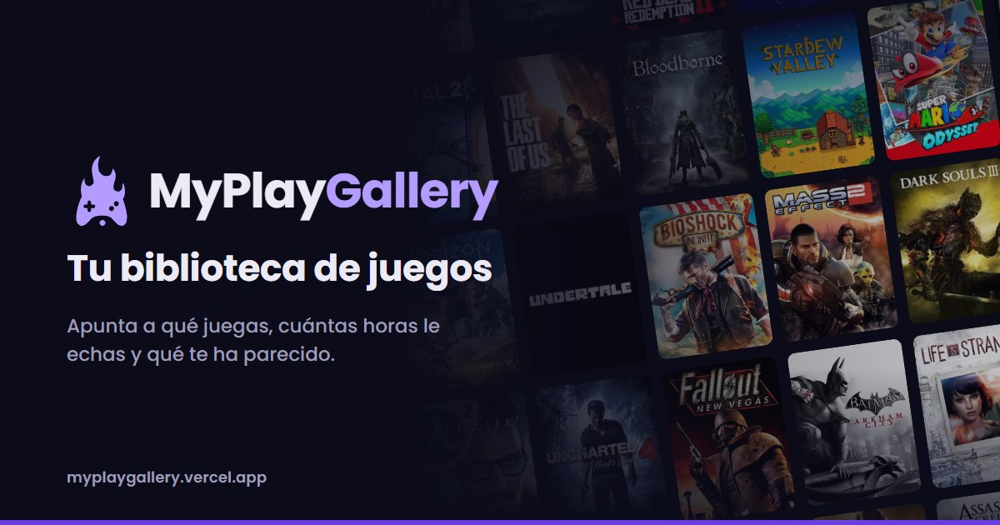
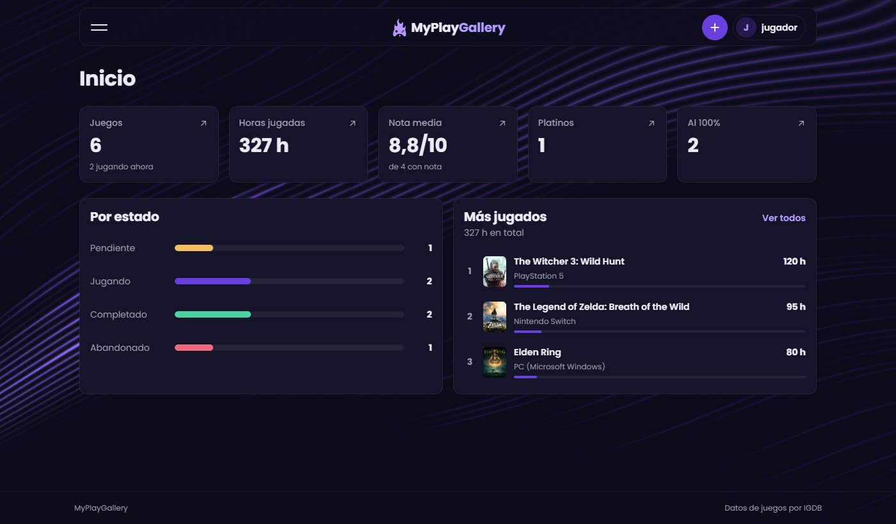
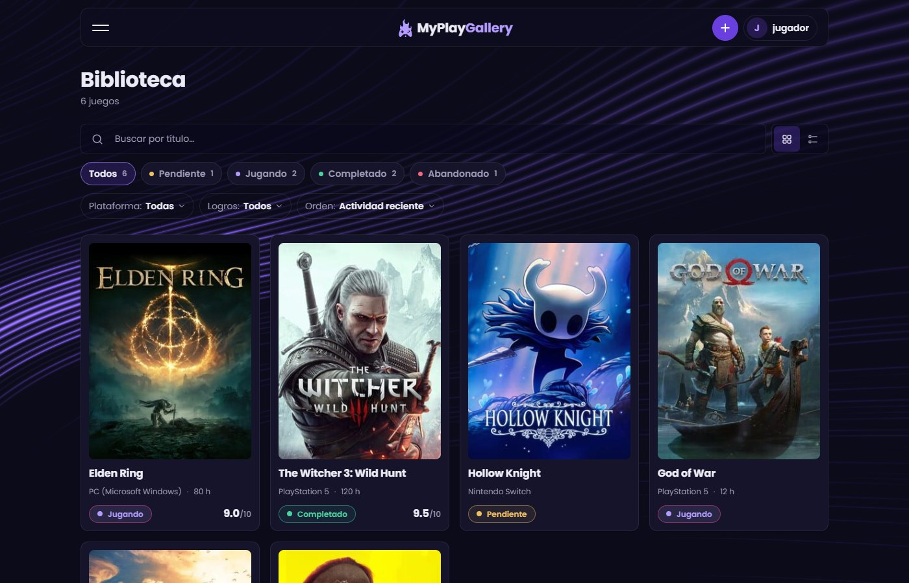
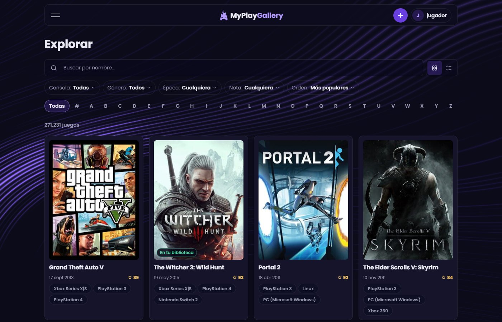
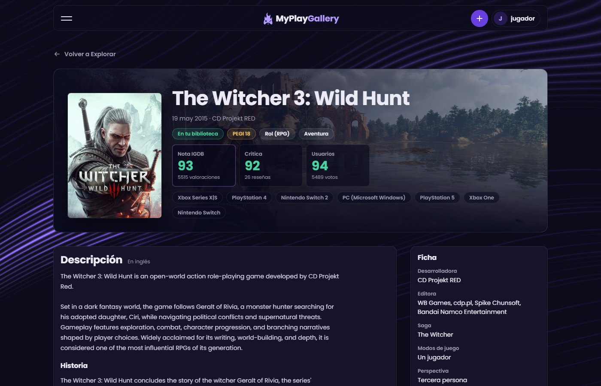
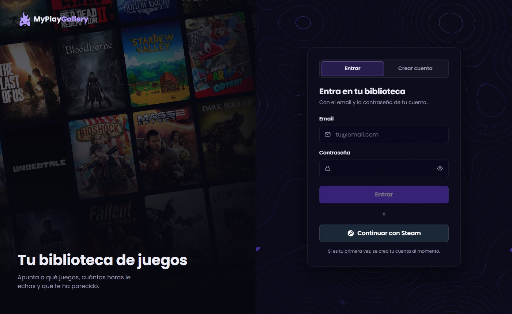
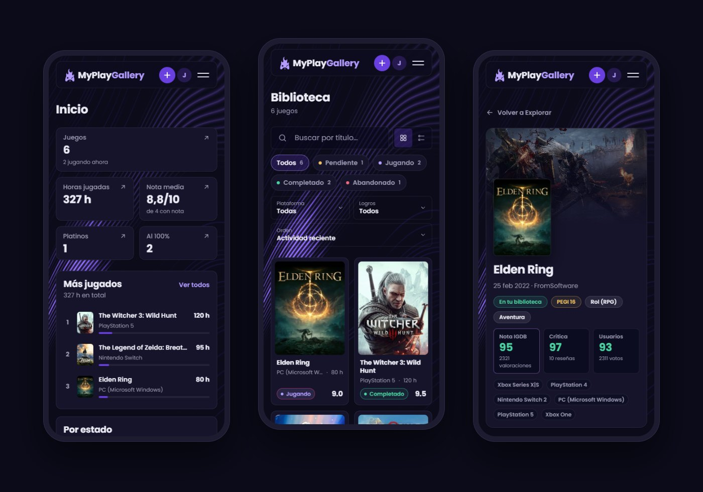
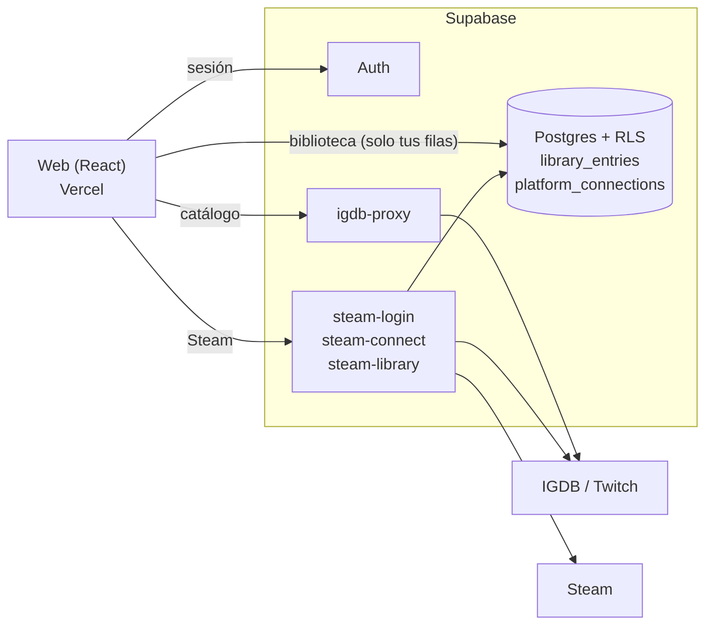

<div align="center">



# MyPlayGallery

**Tu biblioteca de juegos.** Apunta a qué juegas, cuántas horas le echas y qué te ha parecido.

[**Abrir la web →**](https://myplaygallery.vercel.app)


</div>

---

## Qué es

MyPlayGallery es una **biblioteca personal de videojuegos**. Buscas un juego en el catálogo de [IGDB](https://www.igdb.com) (unos 270.000 títulos), lo añades a tu biblioteca y apuntas tu experiencia con él: plataforma, estado, nota, horas, fechas, platino, 100 %, reseña y notas.

Si juegas en Steam, puedes **entrar con tu cuenta de Steam** e **importar tu biblioteca** con las horas reales de cada juego y tus logros.

<p align="center">
  
</p>

## Funcionalidades

**Tu biblioteca**
- **Inicio** con tus cifras (juegos, horas, nota media, platinos y juegos al 100 %), tus 3 juegos más jugados y el reparto por estado. Cada tarjeta lleva a la biblioteca ya filtrada.
- **Biblioteca** con búsqueda, filtros por estado (con recuento), plataforma y logros, y orden por actividad, nota, horas, fecha o título. Vista en **cuadrícula o lista**.
- **Ficha de cada entrada** para editar o borrar, y la opción de tener el mismo juego en varias plataformas.

**El catálogo**
- **Explorar** todo IGDB: por nombre, letra, consola, género, época y nota mínima, con seis órdenes distintos y scroll infinito.
- **Ficha de cada juego**: notas de IGDB, crítica y usuarios, descripción, tráileres, capturas, ficha técnica, duración, lanzamientos por plataforma, tiendas y juegos similares.

**Steam**
- **Entrar con Steam**, con el inicio de sesión oficial; si es tu primera vez, la cuenta se crea al momento.
- **Conectar Steam** desde Ajustes si ya tenías cuenta con email.
- **Importar tu biblioteca de Steam**, con una pantalla de revisión antes de guardar:
  - horas reales de cada juego;
  - estado propuesto según lo que has jugado;
  - **Completado y al 100 % cuando tienes todos los logros**;
  - actualización de horas en los juegos que ya tenías.

**Cuenta**
- Registro con email y contraseña, o con Steam.
- Cada usuario solo ve sus datos, gracias a la seguridad por filas (RLS) de Postgres.

<table>
  <tr>
    <td width="50%"></td>
    <td width="50%"></td>
  </tr>
  <tr>
    <td align="center"><sub><b>Biblioteca</b>: filtros en pastillas y vista en cuadrícula o lista</sub></td>
    <td align="center"><sub><b>Explorar</b>: los ~270.000 juegos de IGDB con filtros y orden</sub></td>
  </tr>
  <tr>
    <td width="50%"></td>
    <td width="50%"></td>
  </tr>
  <tr>
    <td align="center"><sub><b>Ficha del juego</b>: notas, tráileres, capturas, duración y más</sub></td>
    <td align="center"><sub><b>Acceso</b>: email y contraseña o <b>Continuar con Steam</b></sub></td>
  </tr>
</table>

### Pensada también para el móvil

<p align="center">
  
</p>

Rejillas de dos columnas, filtros sin desplazamientos horizontales, botones de al menos 44 px y campos que no hacen zoom en el iPhone.

## Tecnologías

| Parte | Qué se usa |
| --- | --- |
| Interfaz | React 19, TypeScript, Vite, React Router, CSS Modules |
| Datos en el cliente | TanStack Query, Zod (valida todo lo que llega de fuera) |
| Backend | Supabase: Auth, Postgres con RLS y Edge Functions (Deno) |
| Catálogo de juegos | API de IGDB, a través de una Edge Function (las credenciales de Twitch nunca llegan al navegador) |
| Steam | OpenID 2.0 para entrar y conectar la cuenta; Steam Web API para juegos, horas y logros |
| Efectos | Componentes de [React Bits](https://reactbits.dev): CardNav, SpotlightCard, Topography y LineWaves (con `gsap` y `ogl`) |
| Calidad | Vitest, Testing Library, MSW, Oxlint |
| Publicación | Vercel |

## Cómo funciona



- **La biblioteca** está en Postgres y solo guarda tus datos personales. La información de cada juego (título, portada, notas) se pide a IGDB cuando hace falta.
- **Las credenciales** de Twitch y la clave de Steam son secretos de las Edge Functions: nunca llegan al navegador, a Vercel ni al repositorio.
- **Las conexiones de Steam** solo las crea el servidor, después de preguntarle a Steam si el inicio de sesión es auténtico, así que nadie puede apuntarse la cuenta de otro.

## Puesta en marcha

Necesitas **Node.js 20.19 o 22.12 (o superior)**, un proyecto de **Supabase**, una aplicación de **Twitch** (para IGDB) y, si quieres las funciones de Steam, una **clave de la Steam Web API**.

**1. Instalar**

```bash
git clone https://github.com/GodSergio7/MyPlayGallery.git
cd MyPlayGallery
npm install
```

**2. Variables del cliente.** Copia `.env.example` como `.env.local` y rellena:

```bash
VITE_SUPABASE_URL=https://<tu-proyecto>.supabase.co
VITE_SUPABASE_ANON_KEY=<clave pública (anon) de Supabase>
```

Son públicas por diseño, porque los datos los protege RLS. **Nunca pongas secretos en variables `VITE_*`**: acaban en el código que descarga el navegador.

**3. Base de datos.** Aplica las migraciones de `supabase/migrations/`:

```bash
npx supabase link --project-ref <tu-proyecto>
npx supabase db push
```

**4. Secretos y Edge Functions**

```bash
npx supabase secrets set TWITCH_CLIENT_ID=... TWITCH_CLIENT_SECRET=...
npx supabase secrets set STEAM_API_KEY=...                       # opcional: importar desde Steam
npx supabase secrets set ALLOWED_ORIGINS=http://localhost:5173,https://<tu-dominio>

npx supabase functions deploy igdb-proxy --use-api
npx supabase functions deploy steam-connect --use-api
npx supabase functions deploy steam-library --use-api
npx supabase functions deploy steam-login --use-api --no-verify-jwt
```

En el panel de Supabase, en **Authentication › URL Configuration**, añade tu dominio y `http://localhost:5173` a las URL permitidas.

**5. Arrancar**

```bash
npm run dev
```

### Scripts

| Comando | Qué hace |
| --- | --- |
| `npm run dev` | Servidor de desarrollo en `http://localhost:5173` |
| `npm run build` | Comprueba los tipos y genera la web en `dist/` |
| `npm run preview` | Sirve la versión generada |
| `npm test` | Ejecuta los tests |
| `npm run lint` | Revisa el código con Oxlint |

> En el servidor de desarrollo, **Ajustes** muestra además una **zona de pruebas** con un botón para vaciar tu biblioteca, útil para repetir la importación de Steam. No existe en la versión publicada: su código ni siquiera se incluye en la build.

### Publicar en Vercel

1. Importa el repositorio en Vercel. `vercel.json` ya redirige todas las rutas a `index.html`.
2. Añade `VITE_SUPABASE_URL` y `VITE_SUPABASE_ANON_KEY` en **Settings › Environment Variables**.
3. Añade el dominio de Vercel a `ALLOWED_ORIGINS` y a las URL permitidas de Supabase.

## Estructura

```
src/
├── app/            # Rutas, barra de navegación, sesión (AuthProvider)
├── features/       # Una carpeta por pantalla
│   ├── auth/       #   Acceso y registro (email o Steam)
│   ├── dashboard/  #   Inicio
│   ├── library/    #   Biblioteca y ficha de cada entrada
│   ├── explore/    #   Catálogo de IGDB
│   ├── game-info/  #   Ficha de cada juego
│   ├── game/       #   Añadir un juego a la biblioteca
│   ├── search/     #   Búsqueda rápida
│   ├── settings/   #   Ajustes, cuentas conectadas e importación de Steam
│   └── profile/    #   Perfil (provisional)
├── data/           # Acceso a Supabase e IGDB, validado con Zod
└── shared/         # Componentes, hooks, estilos y utilidades comunes
supabase/
├── migrations/     # Tablas y políticas RLS
└── functions/      # igdb-proxy, steam-connect, steam-library, steam-login
docs/specs/         # Especificaciones funcionales (SPEC-00 a SPEC-09)
```

## Especificaciones

El proyecto se desarrolla a partir de especificaciones escritas, en `docs/specs/`. Cada cambio relevante queda registrado en el historial de su SPEC.

| SPEC | Tema |
| --- | --- |
| [SPEC-00](docs/specs/SPEC-00-base-proyecto.md) | Base del proyecto |
| [SPEC-01](docs/specs/SPEC-01-arquitectura.md) | Arquitectura |
| [SPEC-02](docs/specs/SPEC-02-modelo-datos.md) | Modelo de datos |
| [SPEC-03](docs/specs/SPEC-03-ui-ux.md) | Interfaz y experiencia de uso |
| [SPEC-04](docs/specs/SPEC-04-integracion-igdb.md) | Integración con IGDB |
| [SPEC-05](docs/specs/SPEC-05-autenticacion-multiusuario.md) | Autenticación y multiusuario |
| [SPEC-06](docs/specs/SPEC-06-animaciones-react-bits.md) | Animaciones con React Bits |
| [SPEC-07](docs/specs/SPEC-07-explorar-catalogo.md) | Explorar el catálogo |
| [SPEC-08](docs/specs/SPEC-08-ajustes-conexiones.md) | Ajustes y cuentas conectadas (Steam) |
| [SPEC-09](docs/specs/SPEC-09-acceso-con-steam.md) | Entrar con Steam |

## Créditos y licencias de terceros

- **Datos e imágenes de juegos**: [IGDB](https://www.igdb.com), servicio de Twitch. Su API es gratuita para uso no comercial.
- **Steam** y su logotipo son marcas de Valve Corporation. MyPlayGallery no está afiliada a Valve.
- **[React Bits](https://reactbits.dev)**: los componentes de `src/shared/components/reactbits/` están adaptados de React Bits, con licencia **MIT + Commons Clause**. Permite usarlos y modificarlos, **pero no vender el software**. Cada archivo indica su origen y los cambios hechos.
- **Tipografía**: [Poppins](https://fonts.google.com/specimen/Poppins) (licencia OFL), servida desde la propia web con [Fontsource](https://fontsource.org), sin peticiones a Google.
